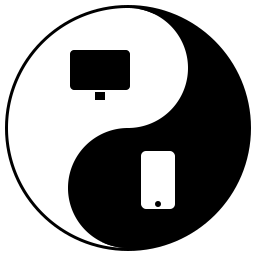

# Device Extensions Switcher

<p align="center">
  
</p>

<p align="center">
  <strong>Simply switch. Nothing else.</strong>
</p>

Choose which Obsidian community plugins should be enabled on desktop, mobile, both, or disabled — while keeping one shared Obsidian configuration folder.

## Important: this plugin does not sync your settings by itself

Device Extensions Switcher manages **which installed community plugins are active on the current device**. It does not sync your vault, your plugins, or your plugin settings by itself.

For the same assignment table to be available on desktop and mobile, your Obsidian configuration must already be synced between devices.

This plugin is designed for setups where you use one shared configuration folder, usually:

```text
.obsidian
```

and that configuration folder is synced between devices.

If you use Obsidian Sync, make sure community plugin syncing is enabled on the devices where you want this plugin to work. In Obsidian Sync settings, community plugins are not synced automatically by default; Obsidian requires enabling community plugin sync options such as **Installed community plugin list** and **Active community plugin list**.

If you use another sync tool, make sure it syncs hidden folders/files and includes the `.obsidian` folder, especially:

```text
.obsidian/plugins/
.obsidian/plugins/device-plugin-switcher/data.json
```

If your devices do not sync Obsidian settings, the plugin will still work locally on each device, but each device will have its own separate assignment table.

Recommended setup:

- Install Device Extensions Switcher on every device where you want it to manage plugins.
- Sync the same `.obsidian` configuration folder between those devices.
- Device Extensions Switcher uses safe defaults for synced setups: it applies device-specific plugin states without saving them into Obsidian's shared active plugin list.
- Restart Obsidian after the first sync so installed plugins and plugin settings are loaded correctly.

## Why this plugin exists

Obsidian already supports using a different configuration folder for different devices, for example:

```text
.obsidian
.obsidian_mobile
```

This can be useful when you want completely separate setups for desktop and mobile. However, this approach is not always convenient.

Many users do not actually need two fully separate Obsidian configurations. In many vaults, most plugins are used on both desktop and mobile and should keep the same settings everywhere. Only a smaller number of plugins need to be device-specific.

For example:

- Some heavy desktop plugins should be disabled on mobile to make Obsidian start faster.
- Some plugins are only useful on desktop.
- Some mobile-specific plugins should only be enabled on mobile.
- Most shared plugins should keep the same settings across both desktop and mobile.

With two separate configuration folders, shared plugins often need to be installed, updated, and configured twice. If you change the settings of a plugin that you use on both devices, you may need to repeat the same change in the other configuration folder.

Device Extensions Switcher was created to solve this problem.

It lets you keep one shared `.obsidian` folder, while controlling where each community plugin should be active.

## Built-in safe defaults

Device Extensions Switcher intentionally keeps advanced apply behavior hidden.

By default, it:

- applies the correct device state automatically on Obsidian startup
- waits briefly during startup so Obsidian can load plugin manifests
- protects itself from being disabled by its own table
- applies plugin states without saving them into Obsidian's shared active plugin list

The assignment table is still saved in this plugin's own settings and can be synced between devices.

## What it does

Device Extensions Switcher adds a simple table to the plugin settings.

For each installed community plugin, you can choose one of four modes:

- **Both** — enabled on desktop and mobile
- **Desktop only** — enabled only on desktop
- **Mobile only** — enabled only on mobile
- **Disabled** — disabled everywhere

When Obsidian starts, the plugin detects whether it is running on desktop or mobile and applies the correct plugin state.

## User interface

The settings screen is designed for both desktop and mobile.

On desktop, Device Extensions Switcher uses a full table with separate columns for **Both**, **Desktop only**, **Mobile only**, and **Disabled**. The table header stays visible while scrolling through a long plugin list.

On mobile, the table uses a compact selector for each plugin instead of multiple columns. This keeps the settings usable on small screens.

Changes are applied immediately on the current device. For example, if you mark a plugin as **Mobile only** while using Obsidian on desktop, that plugin is disabled on desktop right away.

## Example

You may want a setup like this:

| Plugin | Mode |
|---|---|
| Dataview | Both |
| Tasks | Both |
| Omnisearch | Both |
| Style Settings | Both |
| Templater | Desktop only |
| QuickAdd | Desktop only |
| Obsidian Git | Desktop only |
| Advanced Mobile Toolbar | Mobile only |
| A heavy plugin you rarely use | Disabled |

This keeps shared plugins and their settings in one place, while still allowing desktop and mobile to have different active plugin sets.

## Why not just use two config folders?

Using two configuration folders is still a good solution when you want completely different Obsidian setups.

For example, separate config folders are useful if you need different:

- themes
- workspaces
- hotkeys
- editor settings
- plugin settings
- mobile and desktop layouts

However, if most of your plugins should stay the same on both devices, two config folders can create extra maintenance work.

You may need to:

- install the same plugin twice
- update the same plugin twice
- configure the same plugin twice
- keep shared plugin settings manually in sync
- remember which settings belong to which device

Device Extensions Switcher is useful when you want one shared configuration, but different active plugins depending on the device.

## When this plugin is useful

This plugin is especially useful if:

- you use the same vault on desktop and mobile
- you sync one `.obsidian` folder between devices
- most of your plugins should have the same settings everywhere
- you want to disable heavy plugins on mobile
- you want some plugins to run only on desktop
- you want mobile-specific plugins to run only on mobile
- you do not want to maintain two separate config folders

## When this plugin may not be the right choice

This plugin is not a full replacement for separate configuration folders.

You may still prefer separate config folders if you need different settings for the same plugin on different devices.

For example, if you want Dataview to have one configuration on desktop and a different configuration on mobile, then a shared `.obsidian` folder may not be enough.

Device Extensions Switcher is best when shared plugins should also share their settings.

## Features

- Detects desktop or mobile Obsidian automatically
- Lets you choose where each plugin should be active
- Provides a table-based settings UI
- Supports four plugin modes: Both, Desktop only, Mobile only, Disabled
- Protects itself from being disabled accidentally
- Helps keep one shared `.obsidian` configuration folder
- Useful for improving mobile startup performance
- No telemetry
- No network requests

## Installation

### From Obsidian Community Plugins

Once the plugin is available in the Obsidian community plugin directory:

1. Open **Settings**
2. Go to **Community plugins**
3. Search for **Device Extensions Switcher**
4. Install the plugin
5. Enable it
6. Open the plugin settings and choose the mode for each plugin

### Manual installation

Download the latest release and copy these files:

```text
main.js
manifest.json
styles.css
```

into:

```text
YourVault/.obsidian/plugins/device-plugin-switcher/
```

Then restart Obsidian and enable the plugin in **Community plugins**.

## Usage

1. Make sure your Obsidian configuration/plugin settings are synced between the devices where you want to use the same assignment table.
2. Install and enable **Device Extensions Switcher** on each device.
3. Open **Settings**.
4. Go to **Device Extensions Switcher**.
5. Find the plugin table.
6. Select a mode for each installed plugin:
   - Both
   - Desktop only
   - Mobile only
   - Disabled
7. Changes are applied immediately on the current device.
8. Restart Obsidian after the first sync if plugins or plugin settings were just downloaded.

## Recommended setup

A common setup is:

### Both

Plugins that are useful everywhere and should keep the same settings:

```text
Dataview
Tasks
Omnisearch
Style Settings
Calendar
```

### Desktop only

Plugins that are heavy, development-focused, or only needed on desktop:

```text
Templater
QuickAdd
Obsidian Git
Linter
```

### Mobile only

Plugins that are only useful on phones or tablets:

```text
Advanced Mobile Toolbar
mobile-specific plugins
```

### Disabled

Plugins that should stay installed but not active:

```text
plugins you rarely use
experimental plugins
temporary plugins
```

## Notes about plugin settings

Device Extensions Switcher controls whether a plugin is active on desktop, mobile, both, or disabled.

It does not create separate settings for the same plugin.

If a plugin is set to **Both**, it uses the same plugin settings on desktop and mobile. This is intentional and is one of the main reasons this plugin exists.

## Safety note

Device Extensions Switcher changes the active state of other community plugins.

For safety, Device Extensions Switcher protects itself from being disabled accidentally. It also does not appear in its own assignment table, so you cannot disable the switcher through the switcher itself.

## Limitations

Obsidian does not currently provide a fully public stable API for enabling and disabling other community plugins. Device Extensions Switcher uses Obsidian's internal plugin manager for this behavior.

This means the plugin is intended to be practical and useful, but future Obsidian updates may require adjustments.

## Privacy

Device Extensions Switcher does not collect data.

It does not use telemetry, analytics, or external network requests.

All settings are stored locally in your vault configuration.

## Development

Install dependencies:

```bash
npm install
```

Build the plugin:

```bash
npm run build
```

Development build:

```bash
npm run dev
```

Prepare release files:

```bash
npm run prepare-release
```

## License

MIT
